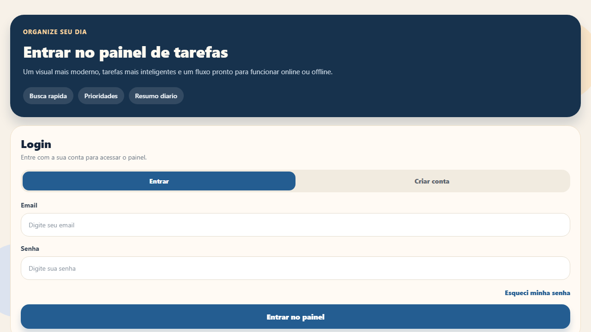
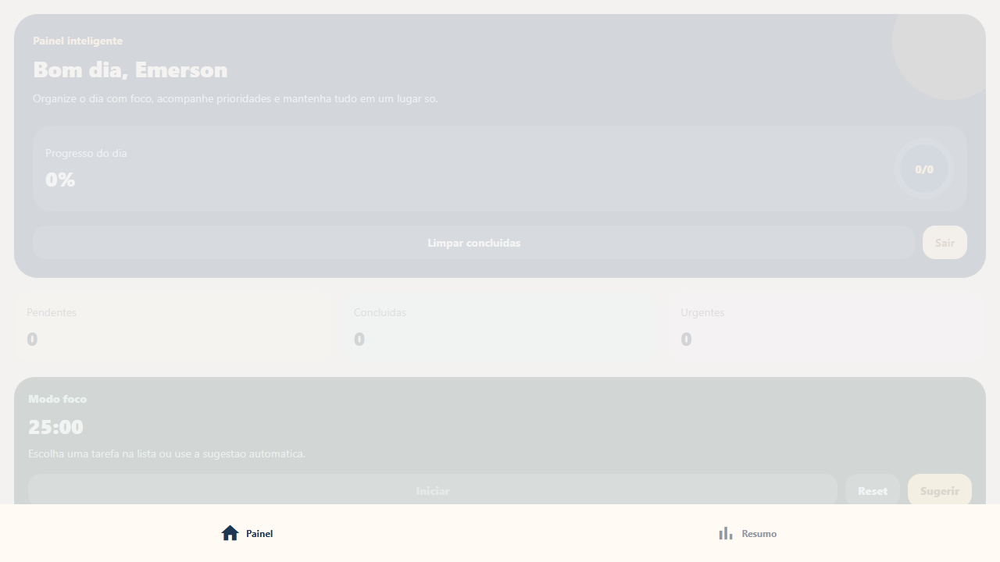
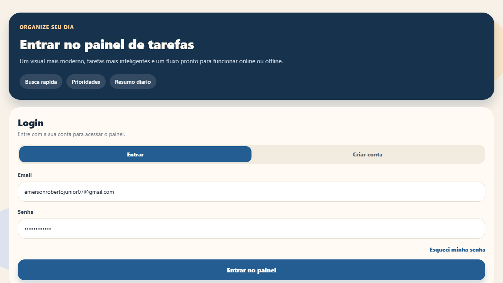
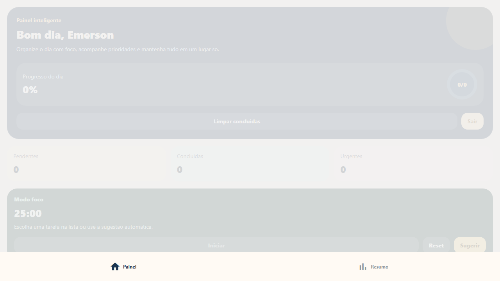
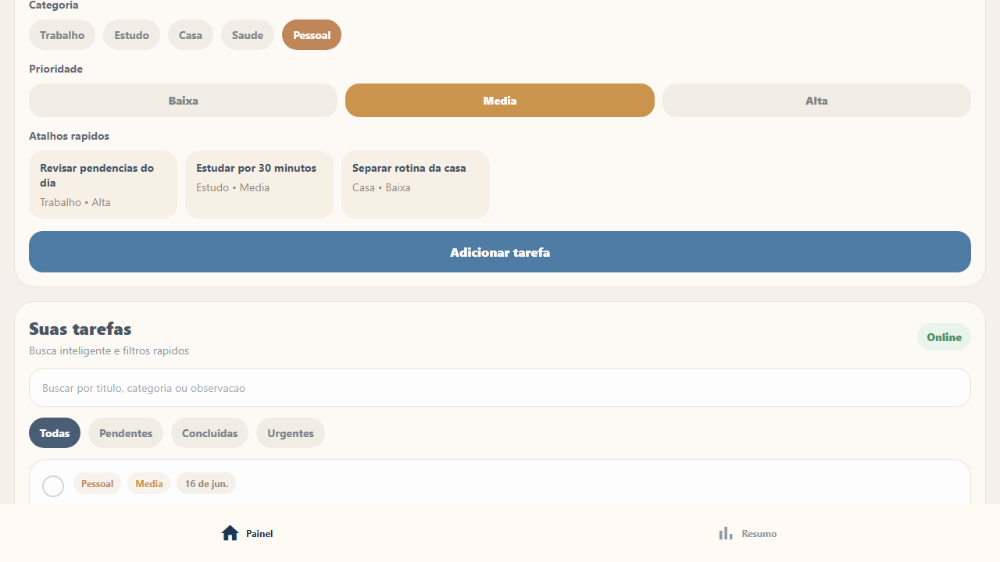
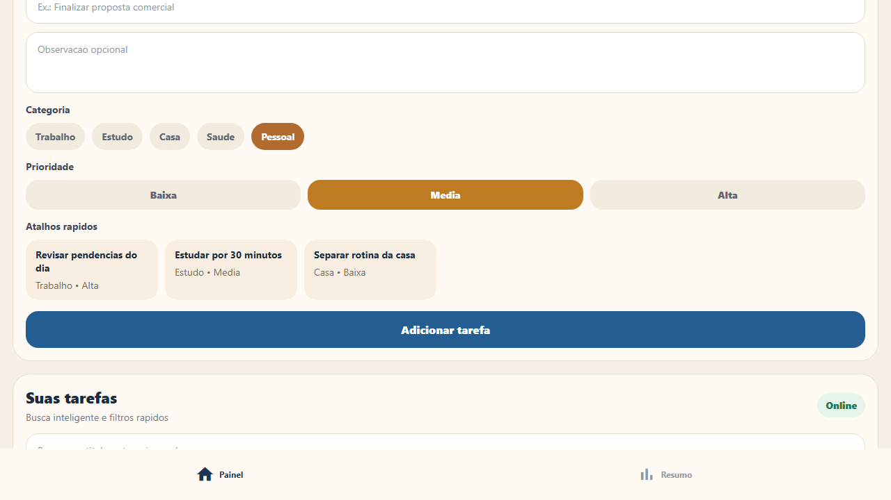
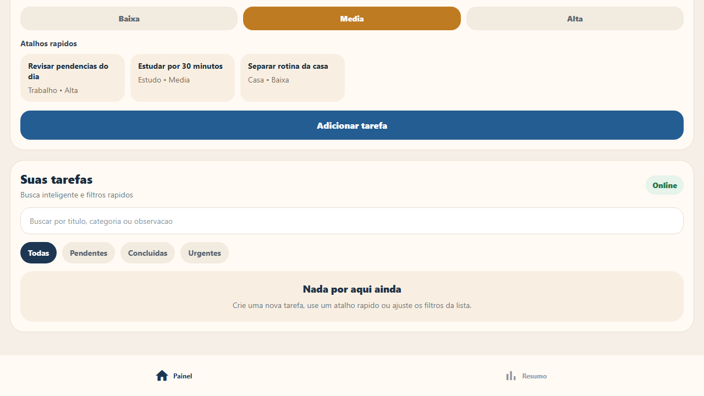

# Relatorio de Testes E2E com Playwright - TarefasApp

## 1. Objetivo

Validar os principais fluxos do TarefasApp usando testes automatizados de navegacao com Playwright, cobrindo login, carregamento da lista de tarefas, cadastro, edicao, exclusao, busca e logout.

## 2. Ambiente de teste

- Projeto: TarefasApp
- Framework: Expo / React Native Web
- Ferramenta de teste: Playwright
- Navegador usado: Chromium
- URL testada: `http://127.0.0.1:8081`
- Data da execucao: 16/06/2026
- Comando executado: `npx playwright test`
- Resultado geral: 10 testes executados, 10 aprovados, 0 reprovados

## 3. Massa de dados usada

- Email: `emersonrobertojunior07@gmail.com`
- Senha: `123`
- Usuario: `Emerson`

Os testes usam mock das rotas de API para garantir execucao estavel mesmo quando o backend local nao estiver ligado.

## 4. Plano e resultado dos testes

| Caso | Cenario | Resultado esperado | Resultado obtido | Evidencia |
| --- | --- | --- | --- | --- |
| CT01 | Abrir a pagina de login | A tela de login deve carregar com titulo e campos visiveis. | Aprovado | [CT01-login.png](./evidencias/CT01-login.png) |
| CT02 | Tentar login sem preencher campos | O usuario deve permanecer na tela de login. | Aprovado | [CT02-login-vazio.png](./evidencias/CT02-login-vazio.png) |
| CT03 | Login com usuario valido | O sistema deve navegar para o painel de tarefas. | Aprovado | [CT03-login-valido.png](./evidencias/CT03-login-valido.png) |
| CT04 | Login com senha invalida | O sistema deve bloquear o acesso e manter a tela de login. | Aprovado | [CT04-senha-invalida.png](./evidencias/CT04-senha-invalida.png) |
| CT05 | Verificar carregamento da lista de tarefas | A area "Suas tarefas" e o campo de busca devem aparecer. | Aprovado | [CT05-lista-tarefas.png](./evidencias/CT05-lista-tarefas.png) |
| CT06 | Adicionar uma tarefa | A tarefa criada deve aparecer na lista. | Aprovado | [CT06-adicionar-tarefa.png](./evidencias/CT06-adicionar-tarefa.png) |
| CT07 | Editar uma tarefa | O titulo da tarefa deve ser atualizado na lista. | Aprovado | [CT07-editar-tarefa.png](./evidencias/CT07-editar-tarefa.png) |
| CT08 | Excluir uma tarefa | A tarefa excluida deve sumir da lista. | Aprovado | [CT08-excluir-tarefa.png](./evidencias/CT08-excluir-tarefa.png) |
| CT09 | Verificar se a tarefa adicionada aparece na lista | A busca deve encontrar a tarefa cadastrada. | Aprovado | [CT09-tarefa-na-lista.png](./evidencias/CT09-tarefa-na-lista.png) |
| CT10 | Fazer logout e retornar para login | O usuario deve sair do painel e voltar para o login. | Aprovado | [CT10-logout.png](./evidencias/CT10-logout.png) |

## 5. Evidencias visuais

### CT01 - Abrir a pagina de login

### CT02 - Login sem preencher campos

### CT03 - Login com usuario valido

### CT04 - Login com senha invalida

### CT05 - Carregamento da lista

### CT06 - Adicionar tarefa

### CT07 - Editar tarefa

### CT08 - Excluir tarefa

### CT09 - Tarefa aparece na lista

### CT10 - Logout

## 6. Conclusao

Todos os cenarios solicitados foram automatizados e executados com sucesso. O fluxo principal do app foi validado: login, protecao contra login vazio ou invalido, entrada no painel, carregamento da lista, cadastro, edicao, exclusao, busca de tarefa e retorno para a tela de login.

O relatorio HTML gerado pelo Playwright tambem esta disponivel na pasta `playwright-report`.
